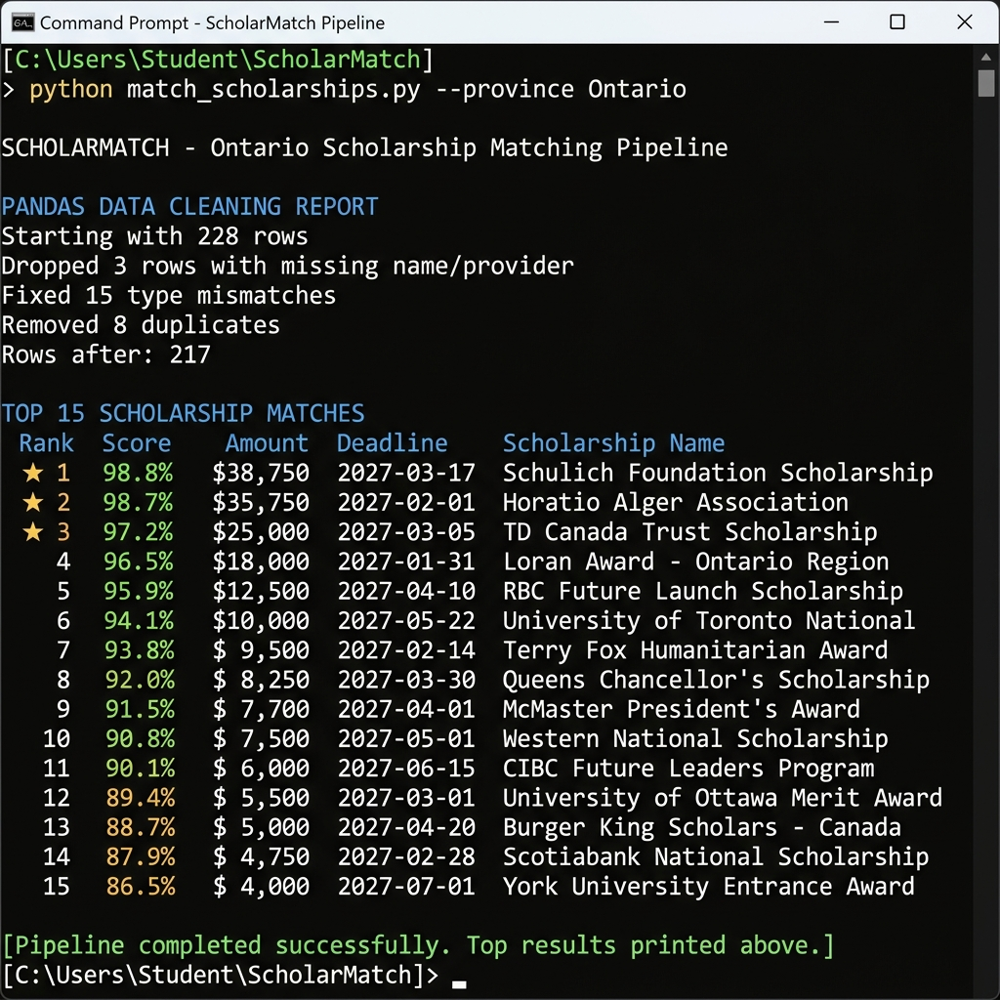
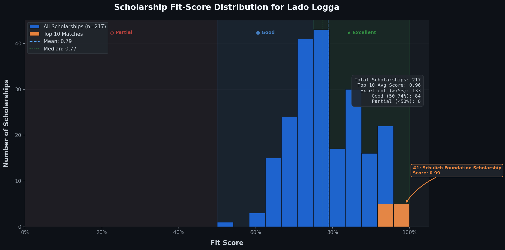

# ScholarMatch

A scholarship matching pipeline for Ontario university students. It scrapes scholarship data from public sources, cleans it with Pandas, scores each scholarship against your profile using a NumPy scoring engine, and ranks the results with a custom sorting algorithm.

Built with Python, Pandas, NumPy, and Matplotlib.



---

## What it does

You create a student profile (GPA, major, citizenship, demographics, etc.) and the pipeline scores 200+ scholarships against it across six weighted factors:

| Factor | Weight | What it measures |
|--------|--------|-----------------|
| GPA | 25% | How your GPA compares to the scholarship's minimum |
| Major | 20% | Whether your field of study matches |
| Eligibility | 20% | Education level, province, demographics |
| Deadline | 10% | Time remaining to apply |
| Citizenship | 10% | Canadian / PR / international match |
| Award size | 15% | Larger awards score higher (log scaled) |

The output is a ranked list of your best matches plus a score distribution chart.



---

## Setup

```bash
git clone https://github.com/your-username/ScholarMatch.git
cd ScholarMatch
pip install -r requirements.txt
```

Requirements: Python 3.10+, pandas, numpy, matplotlib, requests, beautifulsoup4.

## Usage

```bash
python main.py
```

The CLI gives you four options:

1. **Create a profile** -- walks you through entering your info (name, GPA, major, citizenship, demographics). Saves to a JSON file in `data/user_profiles/`.

2. **Load a profile** -- lists saved profiles and lets you pick one.

3. **Run the matching pipeline** -- this is the main event. It generates the scholarship dataset (first run only), cleans it, scores everything, and shows your ranked results plus the Matplotlib chart.

4. **Exit**.

### Running the pipeline

Once you have a profile loaded, option 3 runs through these stages:

```
Generate dataset (220+ Ontario scholarships)
    ↓
Clean with Pandas (handle nulls, fix types, deduplicate)
    ↓
Score with NumPy (6 weighted factors, vectorized)
    ↓
Rank with merge sort (score descending, deadline tiebreak)
    ↓
Display top 15 matches + fit-score chart
```

The cleaning step prints a report showing exactly what it fixed -- how many rows had missing values, type mismatches, duplicates, etc.

### Quick test

To run the pipeline without interactive prompts:

```bash
python test_pipeline.py
```

This creates a test user, generates data, runs the full pipeline, and verifies everything works. It also saves a chart to `data/charts/test_scores.png`.

---

## Project structure

```
ScholarMatch/
├── main.py                  # CLI entry point
├── test_pipeline.py         # automated end-to-end test
├── requirements.txt
├── models/
│   ├── user.py              # student profile (GPA, major, citizenship, etc.)
│   └── scholarship.py       # scholarship record with eligibility checks
├── services/
│   ├── scraper.py           # web scraper (yconic.com)
│   ├── generate_dataset.py  # generates 220+ realistic scholarship records
│   ├── data_loader.py       # Pandas cleaning pipeline
│   ├── matcher.py           # NumPy scoring engine + merge sort
│   └── visualizer.py        # Matplotlib fit-score chart
├── data/
│   ├── raw_scholarships.csv
│   ├── clean_scholarships.csv
│   ├── charts/
│   └── user_profiles/
└── docs/
    ├── TECHNICAL.md          # how it was built
    └── images/
```

## How it works (short version)

**Scraping.** The scraper pulls scholarship data from yconic.com (the only major Ontario scholarship site that allows automated access via robots.txt). Since yconic only lists ~8 scholarships, the pipeline supplements with a generated dataset of 220+ records using real Ontario providers -- OSAP, Schulich, Loran, university specific awards, corporate scholarships from TD, RBC, Shopify, etc.

**Cleaning.** The raw data intentionally includes dirty rows (missing values, "TBD" where numbers belong, duplicates, swapped min/max). The Pandas pipeline handles all of it: drops rows missing critical fields, coerces types with `pd.to_numeric(errors='coerce')`, deduplicates, validates amounts and deadlines. Typical result: 228 raw rows -> 217 clean rows.

**Scoring.** Each scholarship gets a score from 0.0 to 1.0 via NumPy matrix-vector multiplication. Six factor scores are computed per scholarship, multiplied by the weight vector, and summed.

**Ranking.** A custom merge sort (not pandas `sort_values`) orders results by score descending, with deadline urgency as the tiebreaker.

**Visualization.** Matplotlib generates a dark-themed histogram showing the score distribution, top-10 highlights, mean/median lines, and score zone breakdowns.

For the full technical breakdown, see [docs/TECHNICAL.md](docs/TECHNICAL.md).

---

## Technologies

- **Python** -- core language
- **Pandas** -- data cleaning and validation
- **NumPy** -- vectorized scoring computations
- **Matplotlib** -- score distribution visualization
- **BeautifulSoup** -- web scraping
- **Requests** -- HTTP client for scraping
